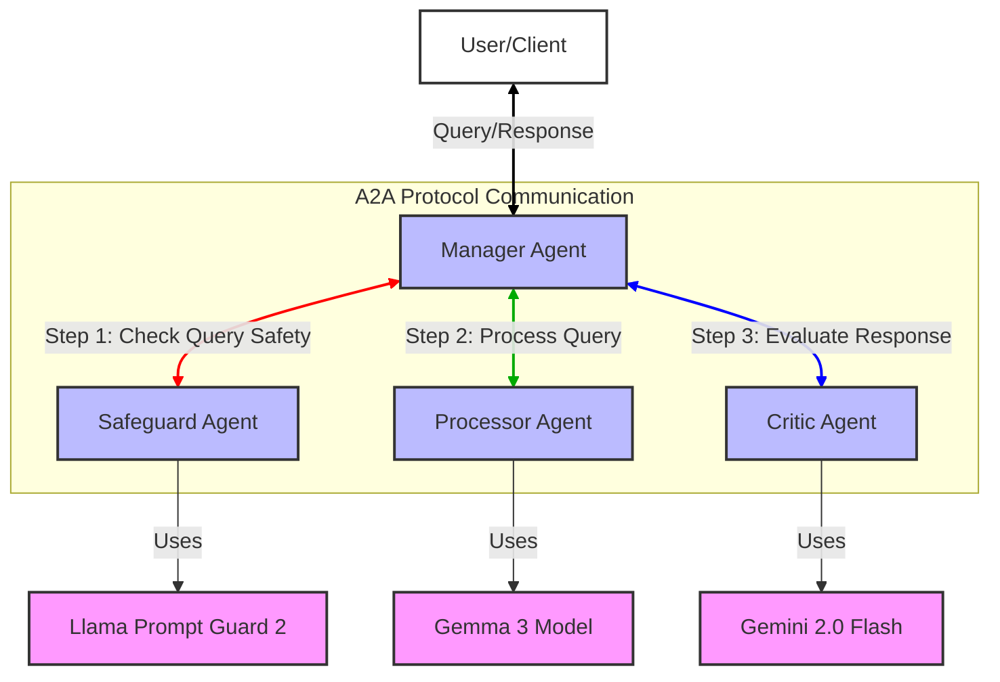

# A2A Double Validation

Multi-agent system for query processing with safety verification and critique 
  built with Google A2A protocol, Google ADK, Llama Prompt Guard 2, Gemma 3 and Gemini 2.0 Flash.

## Architecture



This system uses four agents that work together:

1. **Manager Agent**: Coordinates the flow between agents
2. **Safeguard Agent**: Checks user queries for vulnerabilities using Meta's Prompt Guard 2 model
3. **Processor Agent**: Processes user queries using Gemma 3
4. **Critic Agent**: Evaluates responses for completeness and validity using Gemini 2.0 Flash

Each agent communicates using the Google Agent-to-Agent (A2A) Protocol for inter-agent communication, with FastAPI handling only external user-facing APIs.

## Project Structure

The project is organized by agent, with each agent in its own module:

- **agent_manager/**: Manager Agent implementation
- **agent_processor/**: Processor Agent implementation
- **agent_critic/**: Critic Agent implementation
- **agent_safeguard/**: Safeguard Agent implementation
- **models/**: AI model integrations (Gemini, Gemma, Guard)
- **config/**: Configuration settings
- **utils/**: Utility functions
- **common/**: Common types and A2A protocol implementation

Each agent folder contains:
- **__init__.py**: Module exports
- **__main__.py**: Entry point for running the agent individually
- **task_manager.py**: Agent-specific task management
- **[agent_name].py**: Agent implementation

## Flow

1. User sends a query to the Manager Agent
2. Manager Agent sends user query to Safeguard Agent via A2A
3. Safeguard Agent checks query safety with Prompt Guard 2 and returns assessment via A2A
4. If the query is unsafe, Manager Agent rejects it
5. If safe, Manager Agent sends query to Processor Agent via A2A
6. Processor Agent processes query with Gemma 3 and returns result via A2A
7. Manager Agent sends the query and response to Critic Agent via A2A
8. Critic Agent evaluates response with Gemini 2.0 Flash and returns via A2A
9. Manager Agent returns the processed response with evaluation to the user

## Setup

### Requirements

- Python 3.10+
- Google API Key for Gemini and Gemma models
- Google Vertex AI project for Vertex AI models
- HuggingFace API Token for Prompt Guard 2 model

> **Important Note about Llama Prompt Guard 2**: To use the Llama Prompt Guard 2 model, you must:
> 1. Fill out the "LLAMA 4 COMMUNITY LICENSE AGREEMENT" at [https://huggingface.co/meta-llama/Llama-Prompt-Guard-2-86M](https://huggingface.co/meta-llama/Llama-Prompt-Guard-2-86M)
> 2. Get your request to access this repository approved by Meta
> 3. Only after approval will you be able to download and use this model in the project

### Installation

1. Clone the repository:
   ```bash
   git clone https://github.com/alexey-tyurin/a2a-double-validation.git
   cd a2a-double-validation
   ```

2. Create and activate a fresh virtual environment:
   ```
   python -m venv fresh_env
   source fresh_env/bin/activate  # On Windows: fresh_env\Scripts\activate
   ```
3. Install dependencies:
   ```
   pip install -r requirements.txt
   ```
   
   > **Note**: This project requires NumPy 1.x (not 2.x) for compatibility with PyTorch.
   > If you encounter NumPy-related errors, downgrade NumPy:
   > ```bash
   > pip install numpy==1.26.4
   > ```
   >
   > The Prompt Guard 2 model requires accelerate for efficient loading:
   > ```bash
   > pip install accelerate
   > ```

4. Copy `env.sample` to `.env` and fill in your API keys and project details:
   ```
   cp env.sample .env
   ```
   Be sure to add your HuggingFace token for Prompt Guard 2 model access.

## Running the System

### Running All Agents

You can start all agents at once using either:

```bash
python run_all.py
```

or

```bash
python main.py
```

### Process Management

The repository includes utility scripts to help you manage running processes:

```bash
# Check if all processes are running
./check_processes.sh

# Stop all running processes
./kill_processes.sh
```

The `check_processes.sh` script will verify:
- If the main Python process is running
- If all A2A servers are listening on their expected ports
- The count of running agent processes

The `kill_processes.sh` script will:
- Gracefully terminate all processes related to the application
- Force kill any processes that don't respond to graceful termination
- Clear any processes bound to the application's ports

### Running Individual Agents

You can also run agents individually, which is useful for development or debugging:

```bash
# Start the Manager Agent
python -m agent_manager

# Start the Processor Agent
python -m agent_processor

# Start the Critic Agent
python -m agent_critic

# Start the Safeguard Agent
python -m agent_safeguard
```

The agents will be available on the following ports:

- **A2A Communication Ports**:
  - Manager Agent: http://localhost:8001
  - Safeguard Agent: http://localhost:8002
  - Processor Agent: http://localhost:8003
  - Critic Agent: http://localhost:8004

- **External API Ports** (A2A port + 1000):
  - Manager Agent API: http://localhost:9001
  - Safeguard Agent API: http://localhost:9002
  - Processor Agent API: http://localhost:9003
  - Critic Agent API: http://localhost:9004

## Usage

### Using the Client Utility

The project includes a client utility for interacting with the system:

#### Interactive Mode

```bash
python user_client.py
```

This opens an interactive session where you can type queries and see responses.

#### Single Query Mode

```bash
python user_client.py --query "What is the capital of France?"
```

#### Check System Status

```bash
python user_client.py --status
```

### Running Test Scenarios

The project includes a test script for evaluating the system's performance with both benign queries and prompt injection attacks:

```bash
python test_a2a_scenarios.py
```

This will run 10 benign test queries and 10 prompt injection tests, and provide a summary of the results.

#### Test Options

```bash
# Save test results to a JSON file
python test_a2a_scenarios.py --output results.json

# Test against a different host or port
python test_a2a_scenarios.py --host your-host.com --port 9001
```

The test script will:
- Process 20 predefined test queries (10 benign, 10 prompt injections)
- Parse each response into its components (answer, evaluation, explanation)
- Track which injection attempts were blocked by the system
- Provide a summary of test results
- Optionally save detailed results to a JSON file

### Using API Directly

Send a query to the Manager Agent's API endpoint:

```bash
curl -X POST http://localhost:9001/api/query \
  -H "Content-Type: application/json" \
  -d '{"query": "What is the capital of France?"}'
```

The response will include both the answer and an evaluation of the response quality.

## Cloud Deployment

The A2A Double Validation system can be deployed to Google Cloud Run for scalable, serverless operation.

### Prerequisites

- Google Cloud Platform account
- gcloud CLI installed and configured
- Docker installed locally

### Deployment Steps

1. Create a copy of your environment file for cloud deployment:
   ```bash
   cp .env .env.cloud
   ```
   
   Edit `.env.cloud` to include your API keys and credentials.

2. For VM-based deployments, you can use the provided setup script:
   ```bash
   # Copy the setup script to your cloud VM
   scp setup_cloud.sh user@your-vm-ip:~/
   
   # SSH into your VM and run the script
   ssh user@your-vm-ip
   cd ~/
   chmod +x setup_cloud.sh
   ./setup_cloud.sh
   ```
   
   This script will:
   - Install Python 3.10+ if not already installed
   - Create a Python virtual environment
   - Install all dependencies from requirements.txt
   - Start the application

3. Deploy all agents to Cloud Run:
   ```bash
   ./deploy_to_cloud_run.sh --project your-gcp-project-id
   ```
   
   This script will:
   - Build Docker images for each agent
   - Push them to Google Container Registry
   - Deploy them as Cloud Run services
   - Configure environment variables from your `.env.cloud` file
   - Generate a `cloud_config.py` file with service URLs

### Cloud Process Management

When running in a cloud environment, you can use the included process management scripts:

```bash
# Check status of all processes
./check_processes.sh

# Stop all processes (useful before redeployment)
./kill_processes.sh
```

These scripts are particularly useful for VM-based deployments where you need to monitor process health or restart services.

### Cloud Client

Once deployed, you can interact with the cloud-deployed system using the cloud client:

```bash
python user_client_cloud.py
```

The cloud client works similarly to the local client but connects to the Cloud Run endpoints automatically.

### Cloud Testing

You can also run test scenarios against the cloud deployment:

```bash
python test_a2a_scenarios_cloud.py
```

This will run the same test scenarios as the local test script but against the cloud deployment.

## 🙏 Acknowledgements

This project relies on several advanced AI and communication technologies:

- **Google Agent-to-Agent (A2A) Protocol**: For standardized inter-agent communication
- **Google Agent Development Kit (ADK)**: For agent infrastructure components
- **Meta's Llama Prompt Guard 2**: For safe query validation and prompt injection protection
- **Google Gemma 3**: For efficient user query processing
- **Google Gemini 2.0 Flash**: For rapid response evaluation and criticism

Thanks to all the teams developing these cutting-edge technologies that make advanced multi-agent systems possible.

## Contact Information

For any questions or feedback, please contact Alexey Tyurin at altyurin3@gmail.com.

## License

[License](LICENSE)
